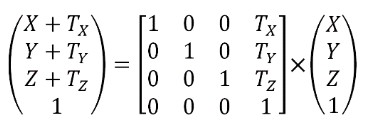
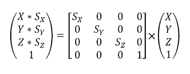
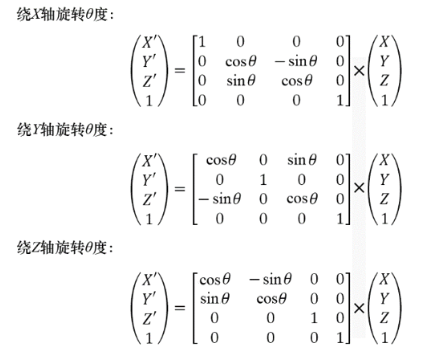
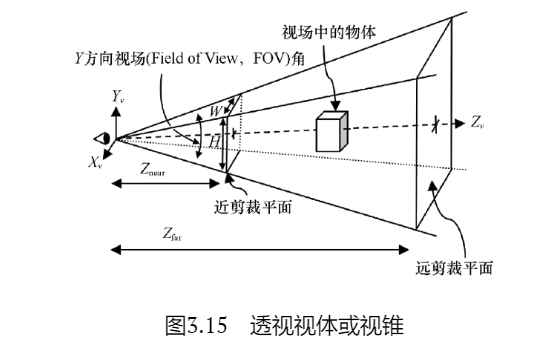
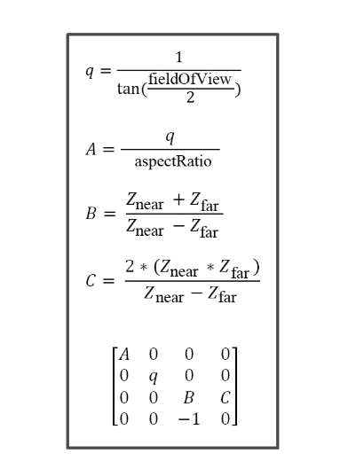
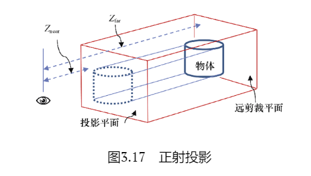
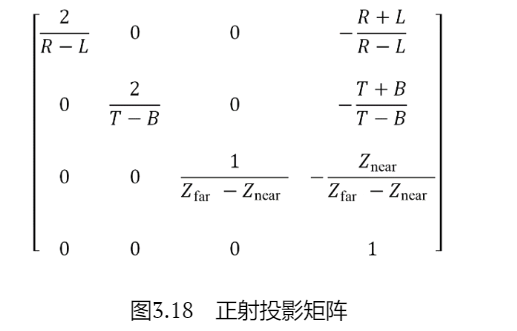
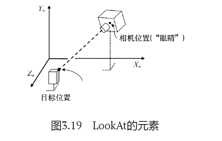
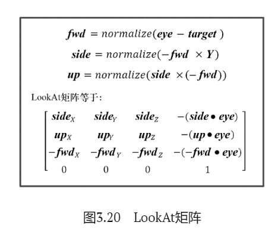

# OpenGL Note

## 第一章
OpenGL只有框架没有实现，换句话说就是OpenGL只有函数声明没有源文件实现，类似于接口和虚函数。所有的实现是显卡生产商提供。比如NVIDIA或者AMD就要自己实现OpenGL函数内容，所以不同的生产商可以对自己的产品提供优化，毕竟代码是自己写的

OpenGL函数库相关的API有核心库(gl)，实用库(glu)，辅助库(aux)、实用工具库(glut)，窗口库(glx、agl、wgl)和扩展函数库等。gl是核心，glu是对gl的部分封装。glx、agl、wgl 是针对不同窗口系统的函数。glut是为跨平台的OpenGL程序的工具包，比aux功能强大（aux很大程度上已经被glut库取代）。扩展函数库是硬件厂商为实现硬件更新利用OpenGL的扩展机制开发的函数。

**GLFW (Graphic Library Framework)** 是一个轻量级、跨平台的开源图形库框架，用于创建窗口、管理 OpenGL 上下文并处理输入事件。

**GLEW (OpenGL Extension Wrangler Library)** 是一个跨平台的开源 C/C++ 扩展加载库，用于自动检测和加载 OpenGL 核心及扩展函数，简化 OpenGL 开发流程

## 第三章
矩阵可以实现五种物体的变换，这些变换都叫做线性变换

- 平移矩阵

- 缩放矩阵

- 旋转矩阵

- 透视投影

- 透视投影矩阵计算公式

- 正射投影

- 正射投影矩阵计算公式

- LookAt

- LookAt矩阵

